<h2>TensorFlow-FlexUNet-Image-Segmentation-Bladder-Cancer-MRI-New-Dice-Metric (2026/09/25)</h2>
Sarah T. Arai 
Software Laboratory antillia.com  
2026/09/25: Updated to use 
<a href="./src/dice_coef_multiclass.py"><b>dice_coef_foreground</b></a>
 instead of <b>dice_loss_multiclass</b> as a metric function. 
2026/09/25: Updated to use 
<a href="./src/focal_dice_loss.py"><b>categorical_focal_dice_loss</b></a> instead of <b>categorical_crossentropy</b> 
as a loss function. 
 
This is the second experiment in Image Segmentation for <b>Bladder-Cancer-MRI</b>
 based on
our <a href="https://github.com/sarah-antillia/TensorFlow-FlexUNet-Image-Segmentation-Model">TensorFlowFlexUNet Model</a>
 (<b>TensorFlow Flexible UNet Image Segmentation Model for Multiclass</b>) and a 512x512-pixel upscaled PNG
 <a href="https://drive.google.com/file/d/1o8i2IhtBAUYlvSTUgqgk8OS1NalSgrST/view?usp=sharing">
Augmented-Bladder-Cancer-ImageMask-Dataset-V3.zip</a> with colorized masks, 
which was derived by us from GitHub 
  
<a href="https://github.com/17764592882/bladder_cancer_dataset">
<b>bladder_cancer_dataset</b>
</a> by huihuangcai.
  
Please see also the first experiment, 
<a href="https://github.com/sarah-antillia/TensorFlow-FlexUNet-Image-Segmentation-Bladder-Cancer-MRI">
TensorFlow-FlexUNet-Image-Segmentation-Bladder-Cancer-MRI</a>, in which we used <a href="./src/dice_coef_multiclass.py">
dice_coef_multiclass</b></a> metric.
  

<b>Actual Image Segmentation for Bladder-Cancer Images of 512x512 pixels</b> 
As shown below, the inferred masks resemble the ground-truth masks except for the third case. 
However, the green bladder wall in the ground truth seems slightly inappropriate.  
<b>class_color_map = {Cancer: dark-red, Wall: green} </b>  
<table>
<tr>
<th width="320" height="auto">Input: image</th>
<th width="320" height="auto">Mask (ground_truth)</th>
<th width="320" height="auto">Prediction: inferred_mask</th>
</tr>
<tr>
<td>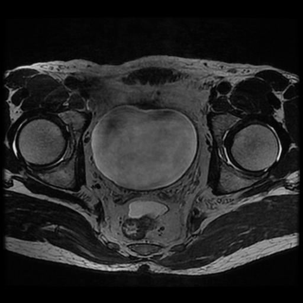</td>
<td>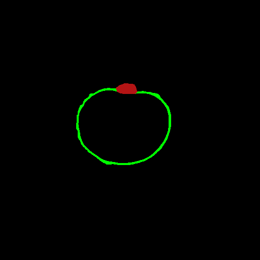</td>
<td>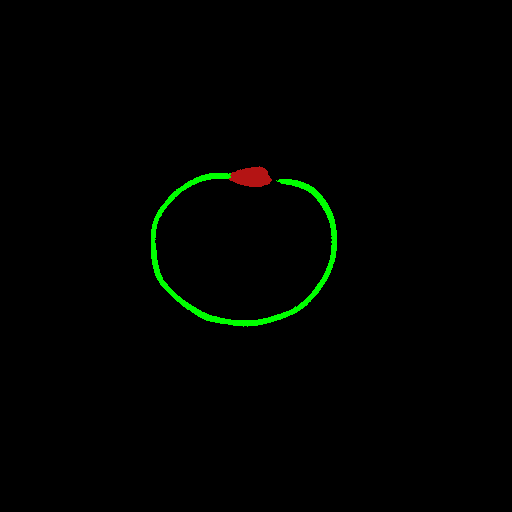</td>
</tr>
<tr>
<td>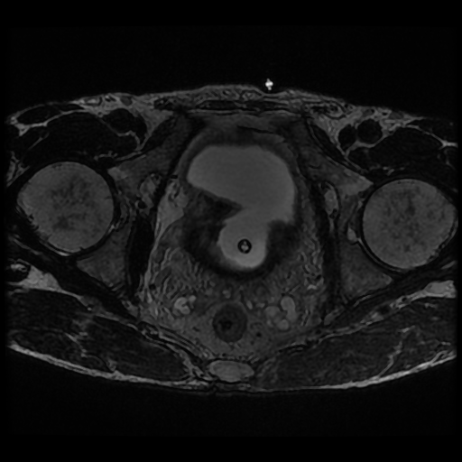</td>
<td>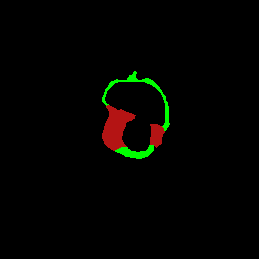</td>
<td>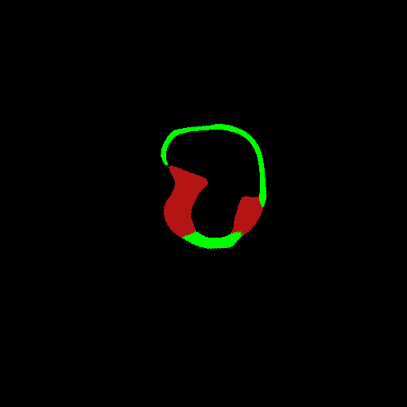</td>
</tr>
<tr>
<td>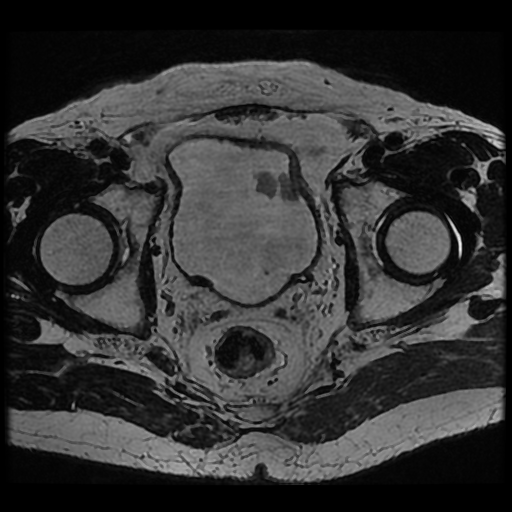</td>
<td>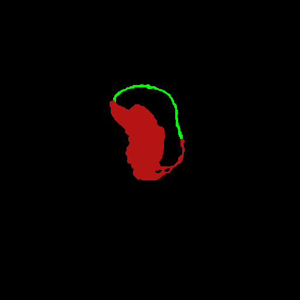</td>
<td>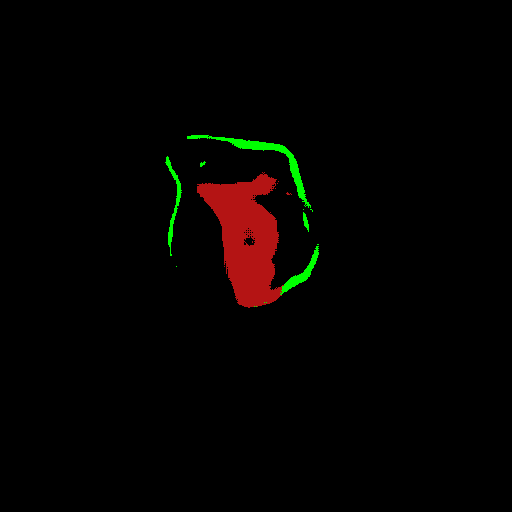</td>
</tr>
</table>

 
<h3>1. Dataset Citation</h3>
The dataset used here was derived from the following GitHub repository:  
<a href="https://github.com/17764592882/bladder_cancer_dataset">
<b>bladder_cancer_dataset</b>
</a> by huihuangcai.
  
The following explanation was taken from the website above.
  
<b>About Dataset</b> 
Thanks to the organizing committee of the China College Students Computer Design Competition. Among them, 
there are 768 pictures of lesions, as shown in the folder tumour_label. The pixel value of 255 represents the lesion spots, 
the gray area represents the bladder wall, and the black area represents the background.
The images displayed in the folder tumour_image are the magnetic resonance images.
 
<b>License</b> 
Unknown
 
 
<h3>
2. Bladder-Cancer Ultrasound ImageMask Dataset
</h3>
<h3>2.1 Download ImageMask Dataset</h3>
 If you would like to train this Bladder-Cancer Segmentation model,
 please download the dataset from Google Drive  
 <a href="https://drive.google.com/file/d/1o8i2IhtBAUYlvSTUgqgk8OS1NalSgrST/view?usp=sharing">
Augmented-Bladder-Cancer-ImageMask-Dataset-V3.zip</a>. 
Expand the downloaded ImageMaskDataset and put it under the <b>./dataset</b> folder.
 
<pre>
./dataset
└─Bladder-Cancer
    ├─test
    │   ├─images
    │   └─masks
    ├─train
    │   ├─images
    │   └─masks
    └─valid
         ├─images
         └─masks
</pre>
 
<b>Bladder-Cancer Statistics</b> 
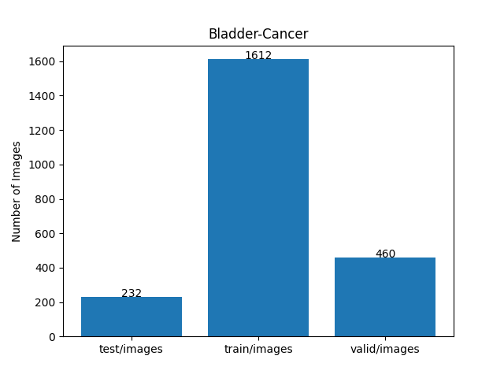 
 
As shown above, the number of images in the training and valid datasets is large enough to use for the
 training set of our segmentation model.
 
<h3>2.2 Derivation of ImageMask Dataset</h3>
The folder structure of the original dataset is as follows.
<pre>
./bladder_cancer_dataset
 ├─tumor_image
 │   ├─19.png
...
 │   └─1994.png
 │ 
 └─tumor_label
      ├─Label19.png
...
      └─Label1994.png
</pre>
<b>Step 1</b> 
We generated a 512x512-pixel PNG master dataset with colorized masks 
<b>(Cancer: dark_red, Wall: green) </b>
from the PNG image files in <b>tumor_image</b> folder and the corresponding PNG mask files in <b>tumor_label</b> folder. 
 
<b>Step 2</b> 
To address the limited size of the master, we generated our own 
Augmented ImageMaskDataset from the master by using the following offline augmentation tools 
<a href="https://github.com/sarah-antillia/Image-Deformation-Tool">Image-Deformation-Tool</a> 
<a href="https://github.com/sarah-antillia/Image-Distortion-Tool">Image-Distortion-Tool</a> 
 
<h3>2.3 Train Sample Images and Masks</h3>
<b>Train_sample_images</b> 
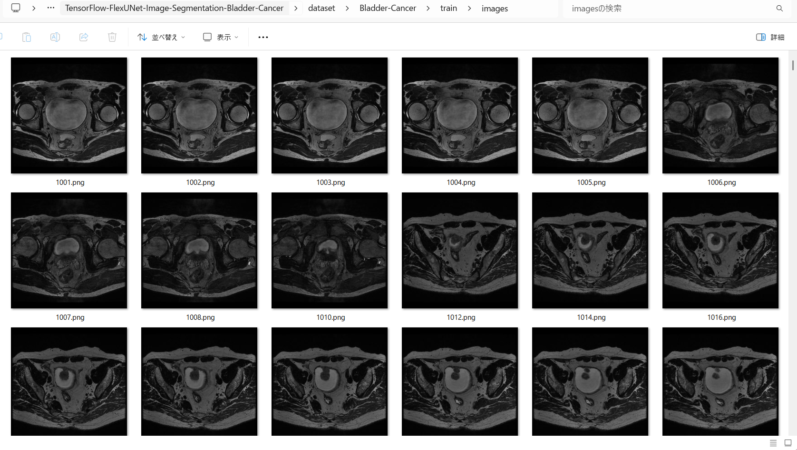
 
<b>Train_sample_masks</b> 
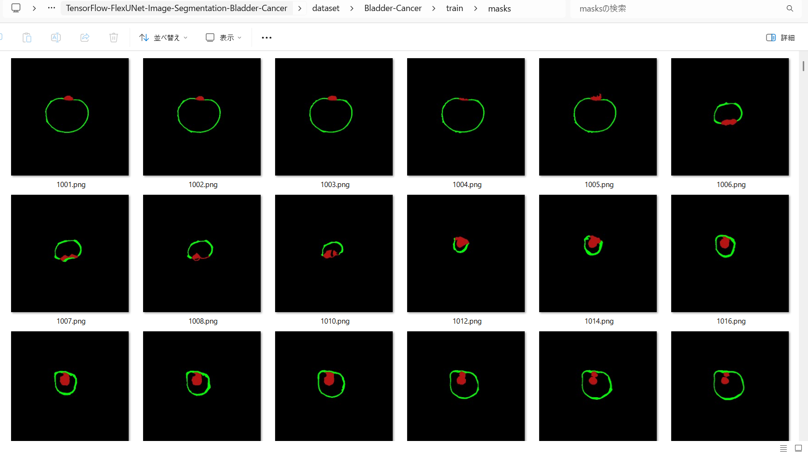
 

<h3>
3. Train TensorFlowFlexUNet Model
</h3>
<h3>3.1 New Evaluation Metric and Loss</h3>
In this experiment, we used the following <a href="./src/dice_coef_multiclass.py"><b>dice_coef_foreground</b></a> 
Dice coefficient as a metric function,
<pre>
"""
This metric calculates the Dice coefficient exclusively for the foreground, excluding the background.
This is a straightforward way to mitigate the class imbalance problem that 
occurs when background pixels occupy an overwhelmingly large portion of a mask image.
"""
def dice_coef_foreground(y_true, y_pred, epsilon=1e-6):
    """
    Args:
        y_true: Ground truth tensor (one-hot encoded). Shape: (batch, height, width, num_classes)
        y_pred: Prediction tensor (probabilities). Shape: (batch, height, width, num_classes)
    """
    y_true = tf.cast(y_true, tf.float32)
    # Get foregrounds by excludeing backgrounds (channel 0)
    y_true_foreground = y_true[..., 1:]
    y_pred_foreground = y_pred[..., 1:]
    
    intersection = K.sum(y_true_foreground * y_pred_foreground, axis=[1, 2])
    sum_ = K.sum(y_true_foreground + y_pred_foreground, axis=[1, 2])
    
    dice = (2. * intersection + epsilon) / (sum_ + epsilon)
    return dice
</pre>
 
Furthermore, we used 
<a href="./src/focal_dice_loss.py"><b>CategoricalFocalDiceLoss</b></a> class to define our custom loss function. 
<pre>
"""
Please refer to the Custom losses
in https://www.tensorflow.org/guide/keras/training_with_built_in_methods
""" 
class CategoricalFocalDiceLoss(tf.keras.losses.Loss):
 
    def __init__(self, epsilon=1e-6, name="categorical_focal_dice_loss"):
        super().__init__(name=name)
        self.epsilon = epsilon
 
    def dice_loss_multiclass(self, y_true, y_pred):
        y_true = tf.cast(y_true, tf.float32)
        intersection = K.sum(y_true * y_pred, axis=-1)
        sum_ = K.sum(y_true + y_pred, axis=-1)
        dice = (2. * intersection + self.epsilon) / (sum_ + self.epsilon)
        return 1.0 - K.mean(dice)
   
    def call(self, y_true, y_pred):
        # Mixed loss = cce + dice
        cce = tf.keras.losses.categorical_crossentropy(y_true, y_pred)
        dice = self.dice_loss_multiclass(y_true, y_pred)
        return cce + dice

    def get_config(self):
        config = super().get_config()
        config.update({"epsilon": self.epsilon})
        return config
</pre> 
  
<h3>3.2 Training TensorFlowFlexUNet Model</h3>
 We trained the Bladder-Cancer TensorFlowFlexUNet model using the following
<a href="./projects/TensorFlowFlexUNet/Bladder-Cancer/train_eval_infer.config"> <b>train_eval_infer.config</b></a> file.  
Please move to ./projects/TensorFlowFlexUNet/Bladder-Cancer and run the following bat file. 
<pre>
>1.train.bat
</pre>
This runs the following command. 
<pre>
>python ../../../src/TensorFlowFlexUNetTrainer.py ./train_eval_infer.config
</pre>

<b>Model parameters</b> 
Defined a small <b>base_filters=16 </b> and large <b>base_kernels=(11,11)</b> for the first Conv Layer of Encoder Block of 
<a href="./src/TensorFlowFlexUNet.py">TensorFlowFlexUNet.py</a> 
and a large <b>num_layers=8</b> (including a bridge between Encoder and Decoder Blocks).
<pre>
[model]
; You may specify your own UNet class derived from our TensorFlowFlexModel
model         = "TensorFlowFlexUNet"
generator     =  False
image_width    = 512
image_height   = 512
image_channels = 3
num_classes    = 3
base_filters   = 16
base_kernels   = (11,11)
num_layers     = 8
dropout_rate   = 0.04
dilation       = (3,3)
</pre>
<b>Learning rate</b> 
Defined a small learning rate.  
<pre>
[model]
learning_rate  = 0.0001
</pre>
<b>Loss and metrics functions</b> 
Specified <a href=",/src/focal_dice_loss.py">categorical_focal_dice_loss"</a>. 
and <a href="./src/dice_coef_multiclass.py">"dice_coef_foreground"</a>. 
<pre>
[model]
loss           = "categorical_focal_dice_loss"
metrics        = ["dice_coef_foreground"]
</pre>
<b>Dataset class</b> 
Specifed <a href="./src/ImageCategorizedMaskDataset.py">ImageCategorizedMaskDataset</a> class. 
<pre>
[dataset]
class_name    = "ImageCategorizedMaskDataset"
</pre>
 
<b>Learning rate reducer callback</b> 
Enabled the learning_rate_reducer callback and a small reducer_patience.
<pre> 
[train]
learning_rate_reducer = True
reducer_factor     = 0.4
reducer_patience   = 4
</pre>
<b>Early stopping callback</b> 
Enabled early stopping callback with the patience parameter.
<pre>
[train]
patience      = 10
</pre>
<b>RGB Color map</b> 
Specified RGB color map dict for Bladder-Cancer 2 classes. 
<pre>
[mask]
mask_datatype= "categorized"
mask_file_format = ".png"
; Bladder-Cancer RGB color map dict for 1+2 classes.
;      Background: black, Cancer: dark_red, Wall: green
rgb_map = {(0,0,0):0,(180,20,20):1,(0,255,0):2}
</pre>
<b>Epoch change inference callback</b> 
Enabled <a href="./src/EpochChangeInferencer.py">epoch_change_infer callback</a></b>. 
<pre>
[train]
epoch_change_infer       = True
epoch_change_infer_dir   =  "./epoch_change_infer"
num_infer_images         = 6
</pre>
By using this callback, on every epoch change, the inference procedure can be called
 for 6 images in the <b>mini_test</b> folder. This will help you confirm how the predicted mask changes 
 at each epoch during your training process.  
  
As shown below, early in the model training, the predicted masks from our UNet segmentation model showed 
discouraging results.
 However, as training progressed through the epochs, the predictions gradually improved. 
   
 
<b>Epoch_change_inference output at starting (epoch 1,2,3)</b> 
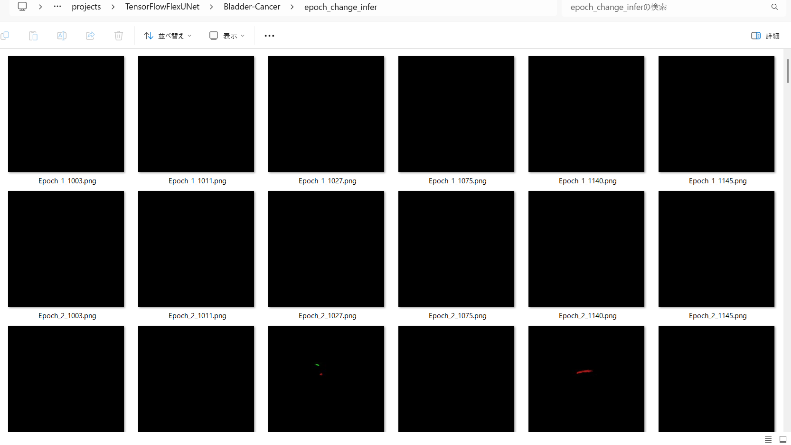 
 
<b>Epoch_change_inference output at middlepoint (epoch 19,20,21)</b> 
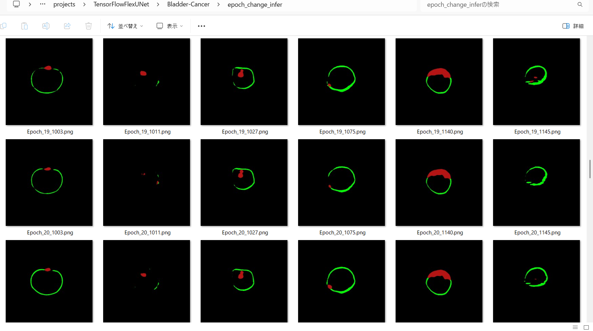 
 
<b>Epoch_change_inference output at ending (epoch 40,41,42)</b> 
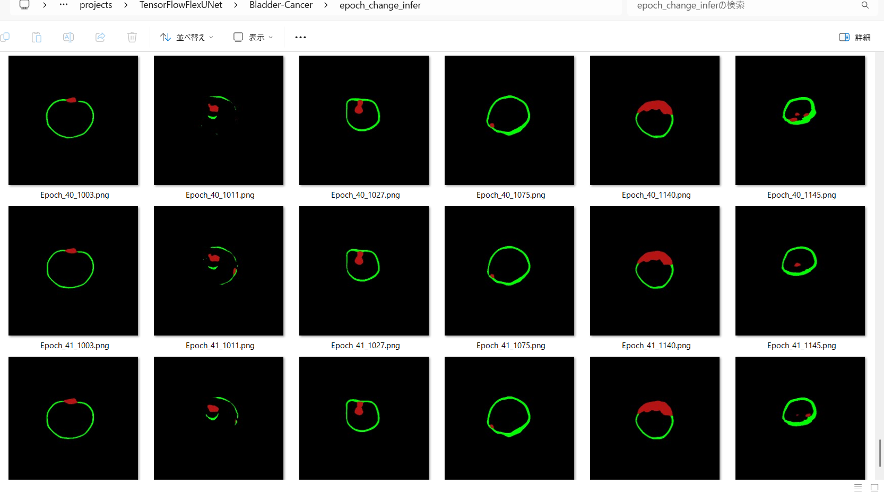 
 
In this experiment, the training process was stopped at epoch 42 by EarlyStoppingCallback. 
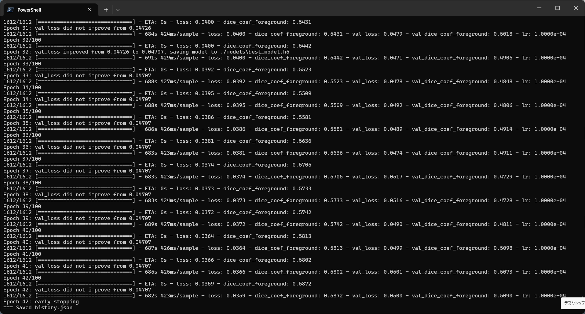 
 
<a href="./projects/TensorFlowFlexUNet/Bladder-Cancer/eval/train_metrics.csv">train_metrics.csv</a> 
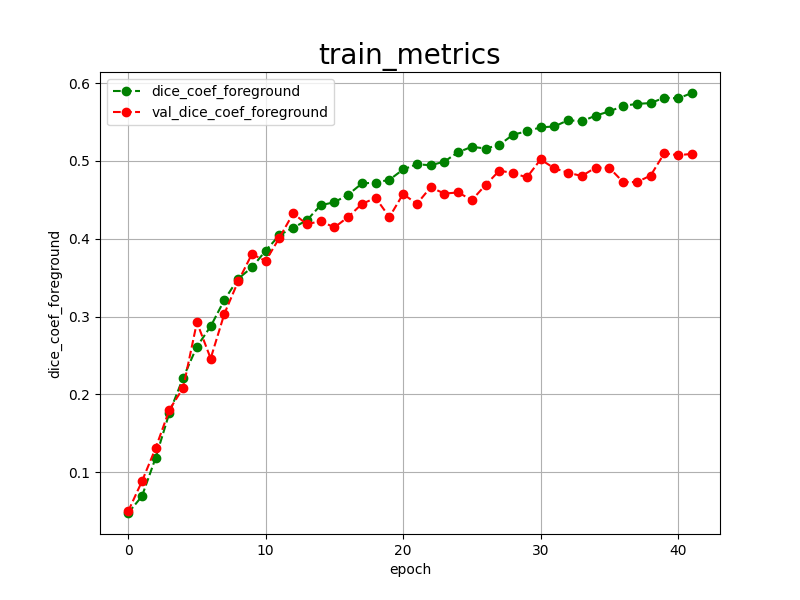 
 
<a href="./projects/TensorFlowFlexUNet/Bladder-Cancer/eval/train_losses.csv">train_losses.csv</a> 
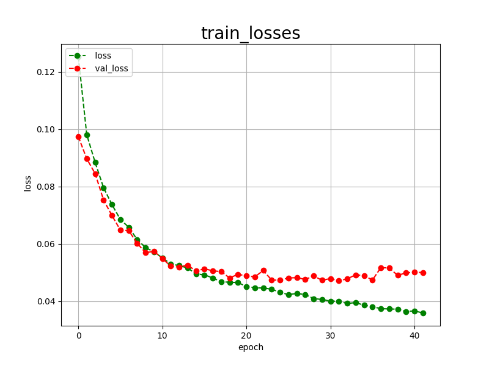 
 
<h3>
4. Evaluation
</h3>
Please move to <b>./projects/TensorFlowFlexUNet/Bladder-Cancer</b> folder, 
and run the following bat file to evaluate the TensorFlowUNet model for Bladder-Cancer. 
<pre>
./2.evaluate.bat
</pre>
This runs the following command.
<pre>
python ../../../src/TensorFlowFlexUNetEvaluator.py ./train_eval_infer_aug.config
</pre>
Evaluation console output: 
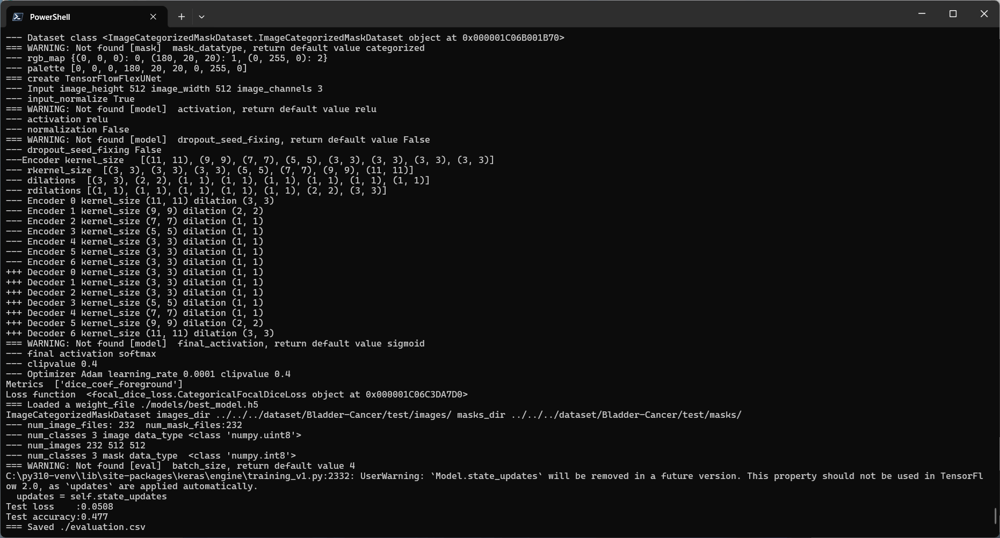
  Image-Segmentation-Bladder-Cancer
<a href="./projects/TensorFlowFlexUNet/Bladder-Cancer/evaluation.csv">evaluation.csv</a> 
The loss (<b>categorical_focal_dice_loss</b>) on Bladder-Cancer/test was not low, but it was not extremely worse.
However, <b>dice_coef_foreground</b> was not high, contrary to our expectations, as shown below.
<pre>
categorical_focal_dice_loss,0.0508
dice_coef_foreground,0.477
</pre>
You might use other metric function something 
like a <a href="./src/dice_coef_multiclass.py"><b>dice_coef_hybrid</b></a> instead of the <b>dice_coef_foreground</b>.
 
<h3>
5. Inference
</h3>
Please move to <b>./projects/TensorFlowFlexUNet/Bladder-Cancer</b> folder
and run the following bat file to infer segmentation regions for images using the trained TensorFlowUNet model for Bladder-Cancer. 
<pre>
./3.infer.bat
</pre>
This runs the following command.
<pre>
python ../../../src/TensorFlowFlexUNetInferencer.py ./train_eval_infer_aug.config
</pre>

<b>mini_test_images</b> 
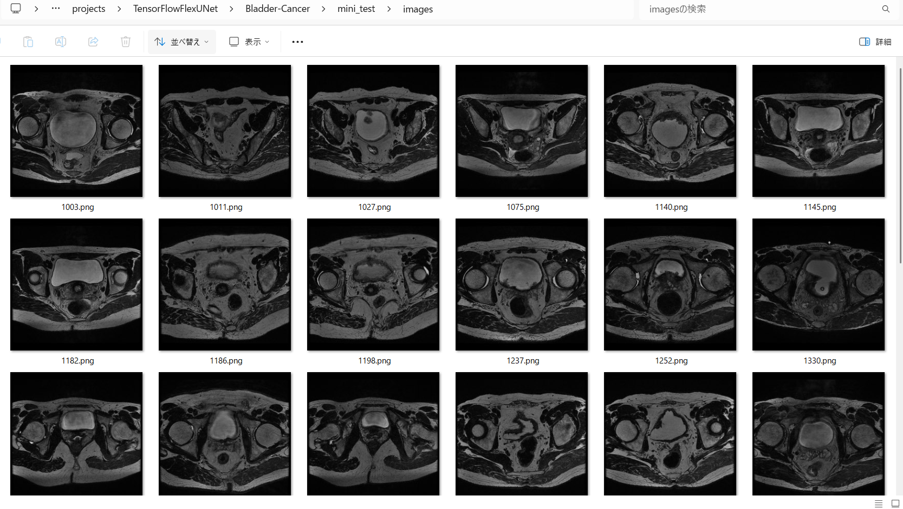 
<b>mini_test_mask(ground_truth)</b> 
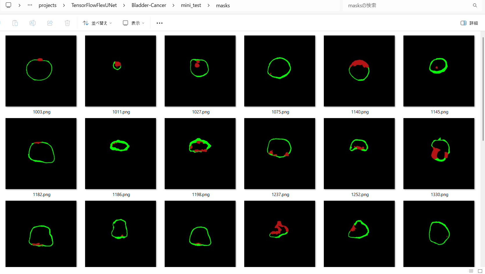 

<b>Inferred test masks</b> 
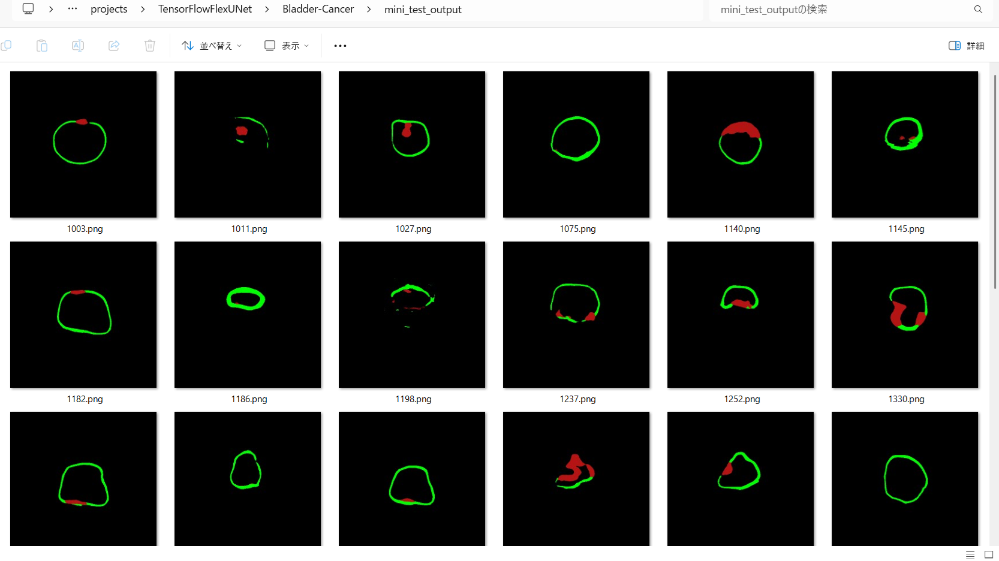 
 

<b>Enlarged images and masks for Bladder-Cancer MRI Images of 512x512 pixels</b> 
As shown below, the inferred masks look similar to the ground truth masks except for the fourth case.
The evaluation scores themselves of thie experiment were not better than those of the first experiment, but 
the thin Bladder walls were detected relatively well. 
  
<b>class_color_map = {Cancer: dark-red, Wall: green} </b>  
<table>
<tr>
<th width="320" height="auto">Image</th>
<th width="320" height="auto">Mask (ground_truth)</th>
<th width="320" height="auto">Inferred-mask</th>
</tr>
<tr>
<td>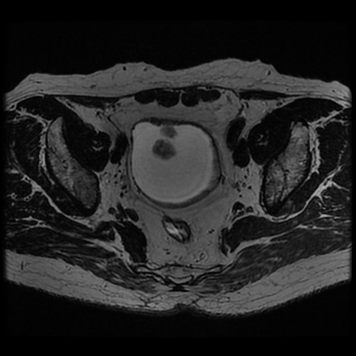</td>
<td>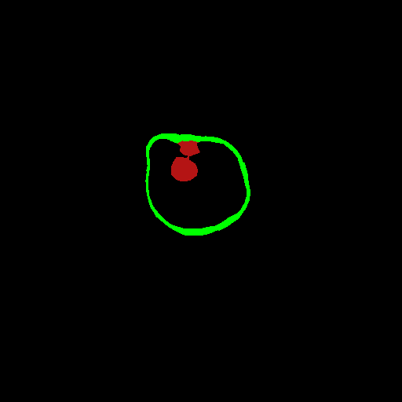</td>
<td>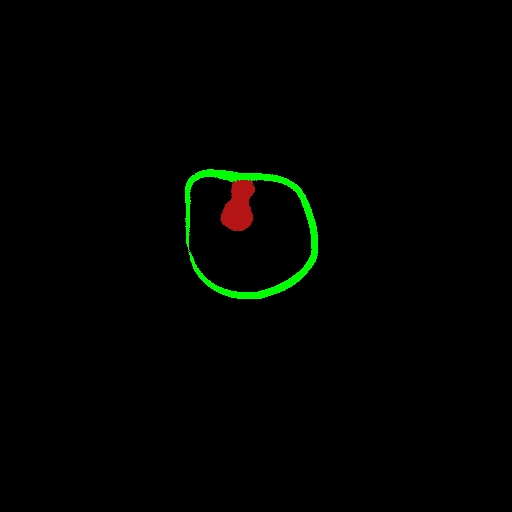</td>
</tr>
<tr>
<td>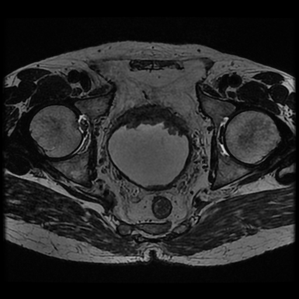</td>
<td>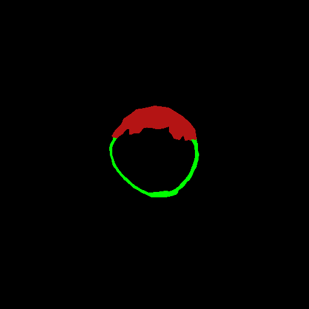</td>
<td>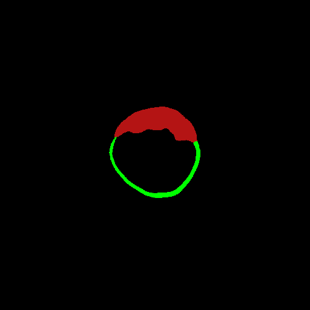</td>
</tr>
<tr>
<td>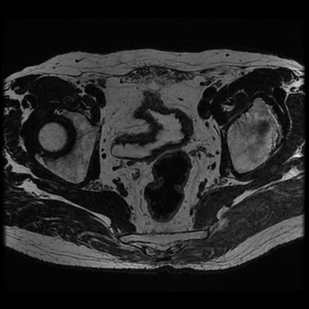</td>
<td>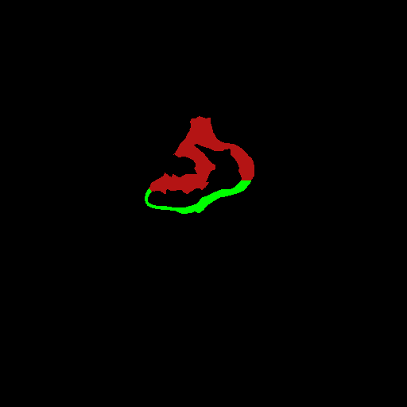</td>
<td>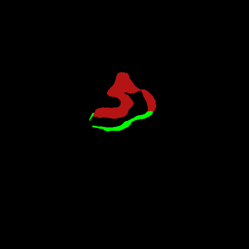</td>
</tr>
<tr>
<td>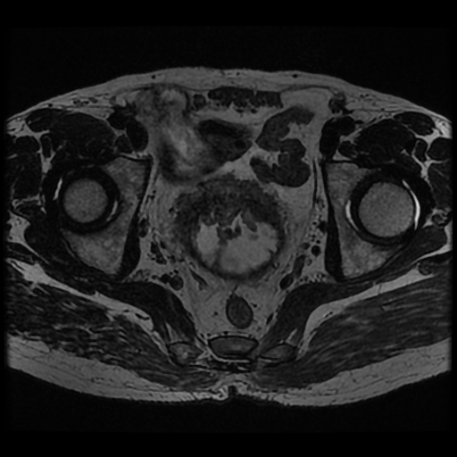</td>
<td>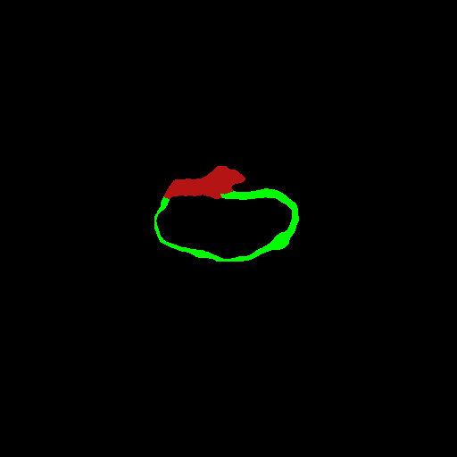</td>
<td>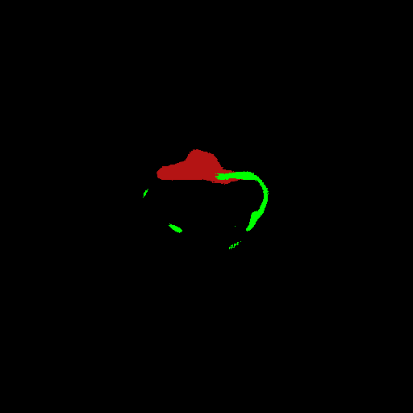</td>
</tr>
<tr>
<td>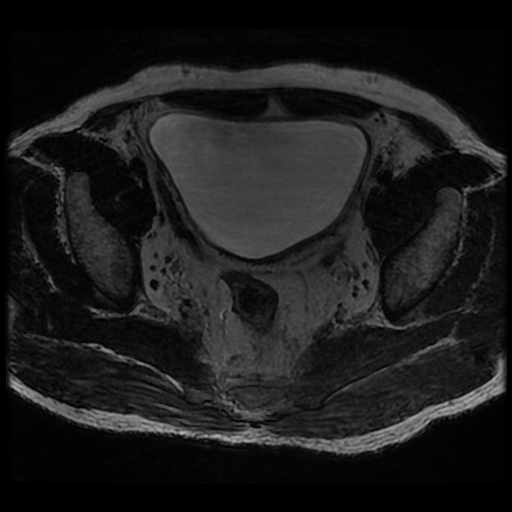</td>
<td>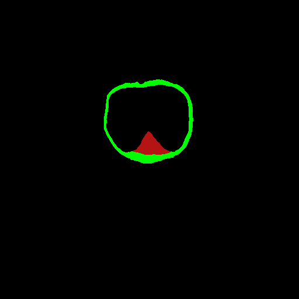</td>
<td>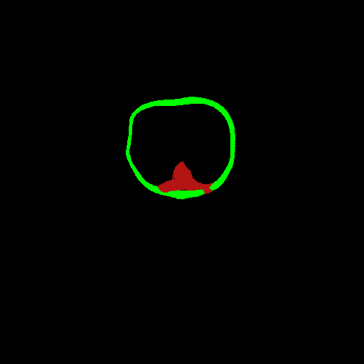</td>
</tr>
<tr>
<td></td>
<td></td>
<td></td>
</tr>
</table>

 
<h3>
References
</h3>
<b>1. A Semi-Supervised Multi-Region Segmentation Framework of Bladder Wall and 
 Tumor with Wall-Enhanced Self-Supervised Pre-Training</b> 
Jie Wei, Yao Zheng, Dong Huang, Yang Liu, Xiaopan Xu, Hongbing Lu 
<a href="https://pmc.ncbi.nlm.nih.gov/articles/PMC11672963/">
https://pmc.ncbi.nlm.nih.gov/articles/PMC11672963/
</a>
  
<b>2. Multi-region segmentation of bladder cancer structures in MRI with progressive  
dilated convolutional network</b> 
Jose Dolz, Xiaopan Xu, Jerome Rony, Jing Yuan, Yang Liu, Eric Granger, Christian Desrosiers, 
Ismail Ben Ayed, and Hongbing Lu 
<a href="https://arxiv.org/pdf/1805.10720">
https://arxiv.org/pdf/1805.10720
</a>
  
<b>3. TensorFlow-FlexUNet-Image-Segmentation-Bladder-Cancer-MRI</b> 
Toshiyuki Arai 
<a href="https://github.com/sarah-antillia/TensorFlow-FlexUNet-Image-Segmentation-Bladder-Cancer-MRI">
https://github.com/sarah-antillia/TensorFlow-FlexUNet-Image-Segmentation-Bladder-Cancer-MRI</a>
  
<b>4. TensorFlow-FlexUNet-Image-Segmentation-Model</b> 
Toshiyuki Arai 
<a href="https://github.com/sarah-antillia/TensorFlow-FlexUNet-Image-Segmentation-Model">
https://github.com/sarah-antillia/TensorFlow-FlexUNet-Image-Segmentation-Model
</a>
  
